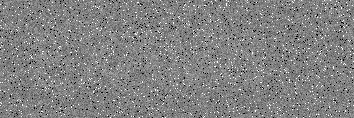
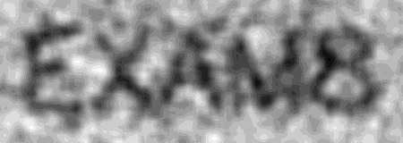

# Noisy Image Cleaning and OCR Text Extraction

Extracting a hidden word from a heavily noisy image, using classic image processing
techniques followed by an OCR engine.

## The problem

The input image contains a word that is invisible to the naked eye, buried under two
different kinds of noise:

| Measure | Value |
|---|---|
| Pixels at 0 and at 255 | 2.48 % and 2.58 %: **impulse** noise (salt and pepper) |
| Standard deviation outside impulses | 19.88: **Gaussian** noise |
| Text / background difference | only **~6 grey levels** |

## Method

The order of the filters follows from the nature of the noise:

1. **Median filter** (kernel 7): non-linear, it *removes* isolated pixels at 0 and
   255 instead of spreading them like a Gaussian blur would.
2. **Mean filter** (kernel 15): smooths the remaining Gaussian noise.
3. **Cropping** to the text area.
4. **Contrast stretching** (`normalize`): essential, because with only 6 grey levels
   of difference, a threshold applied directly cuts the noise, not the text.
5. **Inversion**: dark text on a light background, the format expected by the OCR.
6. **PaddleOCR** for automatic extraction.

## Result

| Original image | Cleaned image |
|---|---|
|  |  |

```
['EXAM8'] [0.9908405542373657]
```

Extracted word: **EXAM8**, confidence 0.99.

The notebook contains the outputs of its execution: each cleaning step is displayed,
up to the OCR result.

## Running

Python 3.11, on CPU.

```
pip install -r requirements.txt
```

Open `noisy_image_ocr.ipynb` in VS Code or Jupyter and run the cells.
The first run downloads the PaddleOCR models.

## Note

On Windows, the following line is required **before** importing PaddleOCR,
otherwise the engine crashes with an internal error (oneDNN bug):

```python
os.environ['FLAGS_use_mkldnn'] = '0'
```
